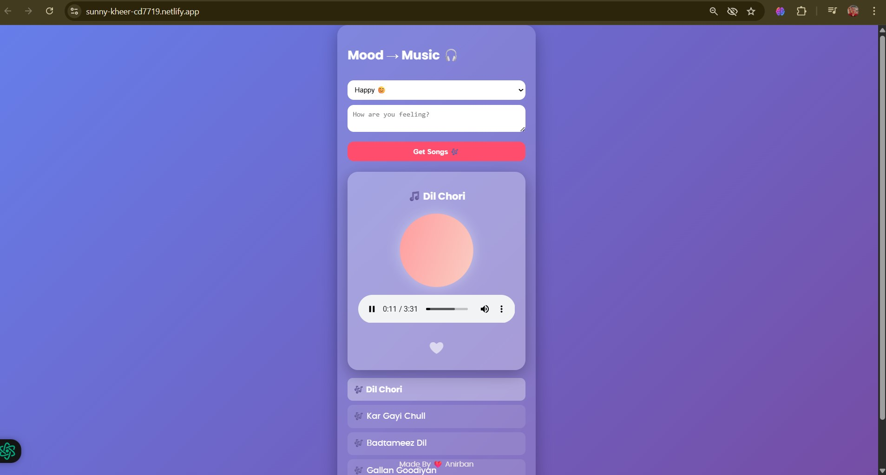

# Mood Music Recommender with Supabase
🎵 Mood Music Recommender: Select your mood &amp; get curated songs! Play Hindi/English tracks in a stylish interactive player with ❤️ like button, animations &amp; glassmorphism UI. Built with JS + Supabase for backend storage 🎶

## ✨ Features

- 😊 Mood-based song recommendation (Happy, Sad, Angry, Chill)
- 🎵 Online audio streaming using Supabase Storage
- 💿 Rotating album animation while music plays
- ❤️ Interactive love (heart) button with animation
- 🔄 Auto-play next song
- 🌈 Glassmorphism UI design
- 📱 Mobile-friendly & responsive

---

## 🛠 Tech Stack

- **Frontend:** HTML, CSS, JavaScript  
- **Backend:** Supabase (Database + Storage)  
- **Hosting:** Netlify / Live Server

---

## 🛢️ Database 

- My first Supabase Database project with use of `sql` commands and some pre installed features 😄
- `SQL`


```sql
### Moods Table

CREATE TABLE moods (
  id BIGSERIAL PRIMARY KEY,
  mood TEXT NOT NULL,
  note TEXT,
  created_at TIMESTAMP DEFAULT NOW()
);

### Songs Table

CREATE TABLE songs (
  id BIGSERIAL PRIMARY KEY,
  mood TEXT NOT NULL,
  song_name TEXT NOT NULL,
  song_url TEXT NOT NULL
);

### Sample Songs

INSERT INTO songs (mood, song_name, song_url) VALUES
('happy', 'Dil Chori', 'https://YOUR_PROJECT.supabase.co/storage/v1/object/public/songs/dil_chori.mp3'),
('sad', 'Tum Hi Ho', 'https://YOUR_PROJECT.supabase.co/storage/v1/object/public/songs/tum_hi_ho.mp3'),
('angry', 'Malhari', 'https://YOUR_PROJECT.supabase.co/storage/v1/object/public/songs/malhari.mp3'),
('chill', 'Raabta', 'https://YOUR_PROJECT.supabase.co/storage/v1/object/public/songs/raabta.mp3');
```

- `BUCKET`
- `PROJECT API`
- `PROJECT URL`
- `.MP3`

---

## 📂 Project Structure

mood-music-player/
- │
- ├── index.html
- ├── style.css
- ├── app.js
- ├── README.md

---

```yaml

## 🗄 Supabase Setup

### 1️⃣ Tables

**songs**
| Column | Type |
|------|------|
| id | int |
| mood | text |
| song_name | text |
| artist | text |
| song_url | text |

**moods**
| Column | Type |
|------|------|
| id | int |
| mood | text |
| note | text |

### 2️⃣ Storage Bucket

- Bucket name: **`songs`**
- Public access: ✅ Enabled
- Upload all `.mp3` files directly inside the bucket

Example URL:
https://YOUR_PROJECT_ID.supabase.co/storage/v1/object/public/songs/dil_chori.mp3
```

```yaml

## 🚀 Run Locally

### Using VS Code Live Server
```bash
live-server --port=3000 --host=0.0.0.0
```

```
http://localhost:3000
```

---

## 🔐 Environment Note
⚠️ Never expose Service Role Key
- Use Supabase Anon/Public Key only in frontend.

---

## 📸 Preview



---

## 👨‍💻 Author

Made with ❤️ by Anirban Banerjee

---

Code ☕ Coffee 🔁 Repeat
